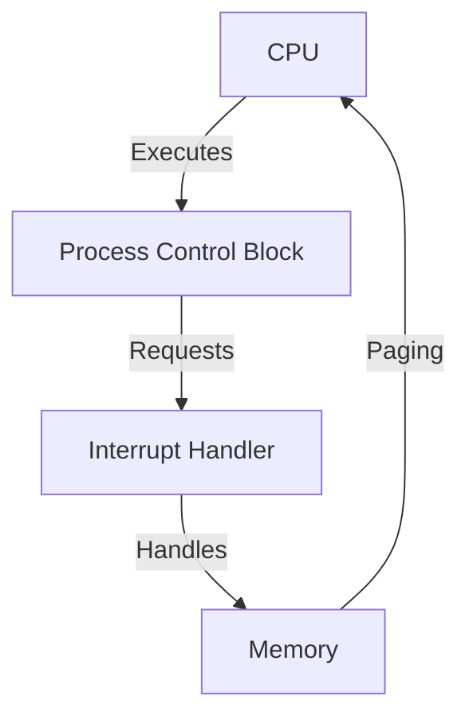

# 🖥️ Multiprogramming Operating System Simulator

---

## 🚀 Tech Highlights

  
**Phase 1:** CPU & Machine Simulation ⚙️ | Supervisor Calls via Interrupts 🚨

  
**Phase 2:** Paging 🗂️ | Error Handling ❌ | Interrupt Generation & Servicing 🔄 | PCB Data Structure 📊

---

## 📊 Architecture Diagram

---

## 💻 Simulation Screenshots

---

## 🌐 Why Use This Simulator?

- **Learn OS Fundamentals:**  
  Grasp multiprogramming, interrupts, memory management, and process control interactively.

- **Tech-Driven Design:**  
  Modern code, real-world scenarios, modular architecture.

- **Educational & Interactive:**  
  Perfect for students, educators, and developers.

---

## ⚡ Tech Stack

- **Languages:** C / C++ / Assembly
- **Structure:** Modular, extensible, educational

---

## 📚 Learn More

- **[Wiki](./wiki)** — Documentation & tutorials  
- **[Issues](https://github.com/ShaikhNomaan-png/Multiprogramming-Operating-System-/issues)** — Report bugs / suggest features

---

**Contributions welcome! Level up your OS knowledge and join the simulation revolution! 💻⚡**
